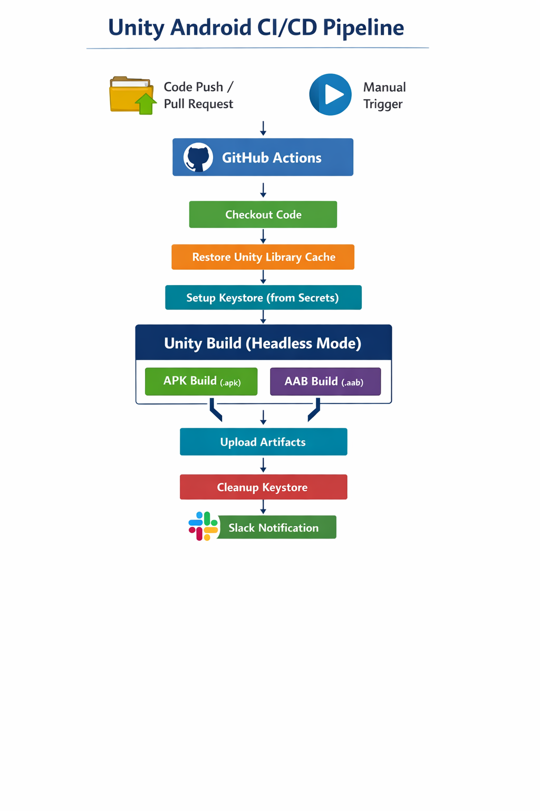

# WRP Unity Android CI/CD Pipeline

Automated **Android CI/CD pipeline for Unity projects** using GitHub Actions.
This pipeline automatically builds **APK** (for direct install) and **AAB** (for Google Play Store) and sends **Slack notifications** after the build.

---
# Pipeline Architecture


# Pipeline Architecture

```
Code Push / Manual Trigger
        ↓
Checkout Repository
        ↓
Cache Unity Library
        ↓
Setup Android Keystore (from GitHub Secrets)
        ↓
Unity APK Build (Headless Mode)
        ↓
Unity AAB Build (Headless Mode)
        ↓
Upload Build Artifacts
        ↓
Cleanup Keystore (Security)
        ↓
Slack Notification (Success / Failure)
```

---

# Repository Structure

```
.
├── Assets/
├── Packages/
├── ProjectSettings/
├── .github/
│   └── workflows/
│       └── unity-android-ci.yml
├── .gitignore
└── README.md
```

---

# Prerequisites

Before using this pipeline make sure the following tools are available:

* Unity Hub installed
* Unity Editor **2022.3.62f3**
* Android Build Support module installed in Unity
* Git installed
* GitHub repository with **GitHub Actions enabled**
* Slack workspace (for notifications)
* Android Keystore file for signing the application

---

# Triggers

The pipeline runs automatically when:

* Code is pushed to **main branch**
* A **Pull Request** is created for main
* Manually triggered using **workflow_dispatch**

---

# Branch Strategy

```
develop → development work
        ↓
Pull Request
        ↓
main → production builds
```

* **develop** → development branch
* **main** → production branch where CI/CD runs

---

# Required GitHub Secrets

Add the following secrets in:

Repository → **Settings → Secrets → Actions**

| Secret                 | Description                  |
| ---------------------- | ---------------------------- |
| UNITY_LICENSE          | Unity license (.ulf) content |
| UNITY_EMAIL            | Unity account email          |
| UNITY_PASSWORD         | Unity account password       |
| ANDROID_KEYSTORE       | Base64 encoded keystore file |
| ANDROID_KEYSTORE_PASS  | Keystore password            |
| ANDROID_KEY_ALIAS      | Key alias name               |
| ANDROID_KEY_ALIAS_PASS | Key alias password           |
| SLACK_WEBHOOK_URL      | Slack incoming webhook URL   |

---

# Setup Instructions

## 1 Generate Android Keystore

```
keytool -genkey -v -keystore wrp-release.jks \
-alias wrp-key -keyalg RSA -keysize 2048 -validity 10000
```

---

## 2 Convert Keystore to Base64

### Windows

```
certutil -encode wrp-release.jks wrp-base64.txt
```

### Linux / Mac

```
base64 -w 0 wrp-release.jks
```

Copy the encoded output and add it as the **ANDROID_KEYSTORE** GitHub secret.

---

## 3 Setup Slack Webhook

1. Go to https://api.slack.com/apps
2. Click **Create New App**
3. Enable **Incoming Webhooks**
4. Click **Add New Webhook**
5. Select a Slack channel
6. Copy the Webhook URL
7. Add it to GitHub Secrets as **SLACK_WEBHOOK_URL**

---

# Manual Build Trigger

To manually run the pipeline:

1. Open the repository on GitHub
2. Go to **Actions**
3. Select **Unity Android CI/CD Pipeline**
4. Click **Run Workflow**

---

# Build Outputs

| Artifact             | Format | Purpose                               |
| -------------------- | ------ | ------------------------------------- |
| Android-APK-{commit} | .apk   | Direct installation on Android device |
| Android-AAB-{commit} | .aab   | Upload to Google Play Store           |

Artifacts are stored for **7 days**.

---

# Security Notes

* Keystore files should **never be committed** to the repository
* All credentials should be stored in **GitHub Secrets**
* Keystore is injected during pipeline runtime
* Keystore file is deleted after the build for security

---

# Design Decisions

### GameCI Unity Builder

Using **GameCI Unity Builder** for CI/CD instead of custom scripts.

Benefits:

* Official CI/CD support for Unity
* Reliable headless builds
* Easier configuration

---

### Unity Library Caching

Caching the **Library folder** significantly improves build speed.

Estimated build times:

First build: **~30 minutes**
Cached builds: **~5–10 minutes**

---

# Successful Pipeline Result

The pipeline produces:

* Android **APK**
* Android **AAB**
* **Slack notification** with build status and artifact link

---

# Author

Muhammad Fahd
DevOps Engineer
